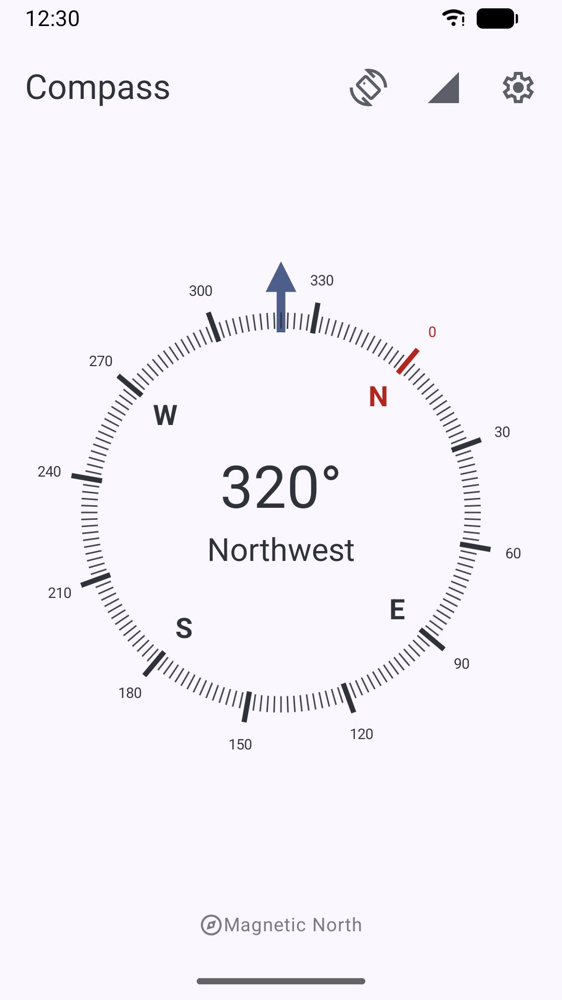
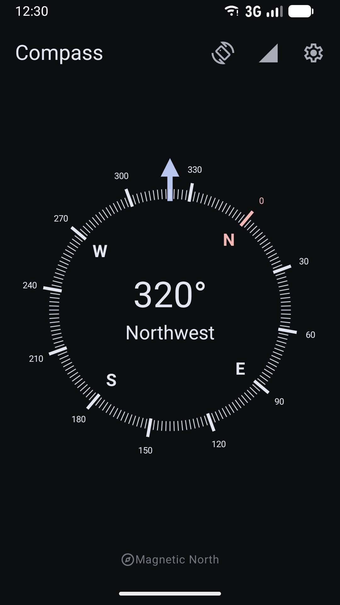

# Compass

This project is intended to offer a simple and good looking compass for Android.

## Screenshots

## Features

* Can point to magnetic north as well as true north
* Shows exact degrees and cardinal direction
* Displays sensor status
* Haptic feedback
* Automatic night mode
* No advertisements
* No annoyance

## Translations

| Code      | Language         | App                | Metadata           | Complete           |
|-----------|------------------|--------------------|--------------------|--------------------|
| *default* | English          | :white_check_mark: | :white_check_mark: | :white_check_mark: |
| bg        | Bulgarian        | :white_check_mark: | :white_check_mark: | :x:                |
| bs        | Bosnian          | :white_check_mark: | :white_check_mark: | :x:                |
| cs        | Czech            | :white_check_mark: | :white_check_mark: | :x:                |
| de        | German           | :white_check_mark: | :white_check_mark: | :white_check_mark: |
| el        | Greek            | :white_check_mark: | :white_check_mark: | :x:                |
| fi        | Finnish          | :white_check_mark: | :white_check_mark: | :x:                |
| fr        | French           | :white_check_mark: | :white_check_mark: | :x:                |
| hr        | Croatian         | :white_check_mark: | :white_check_mark: | :x:                |
| hu        | Hungarian        | :white_check_mark: | :white_check_mark: | :white_check_mark: |
| it        | Italian          | :white_check_mark: | :white_check_mark: | :x:                |
| mk        | Macedonian       | :white_check_mark: | :white_check_mark: | :x:                |
| nb        | Norwegian Bokmål | :white_check_mark: | :x:                | :x:                |
| nl        | Dutch            | :white_check_mark: | :x:                | :x:                |
| ru        | Russian          | :white_check_mark: | :white_check_mark: | :x:                |
| sr        | Serbian          | :white_check_mark: | :white_check_mark: | :x:                |
| tr        | Turkish          | :white_check_mark: | :white_check_mark: | :x:                |
| vi        | Vietnamese       | :white_check_mark: | :white_check_mark: | :x:                |

## License

The project is licensed under the GNU GPL v3.
You can find the license text in the LICENSE file.
