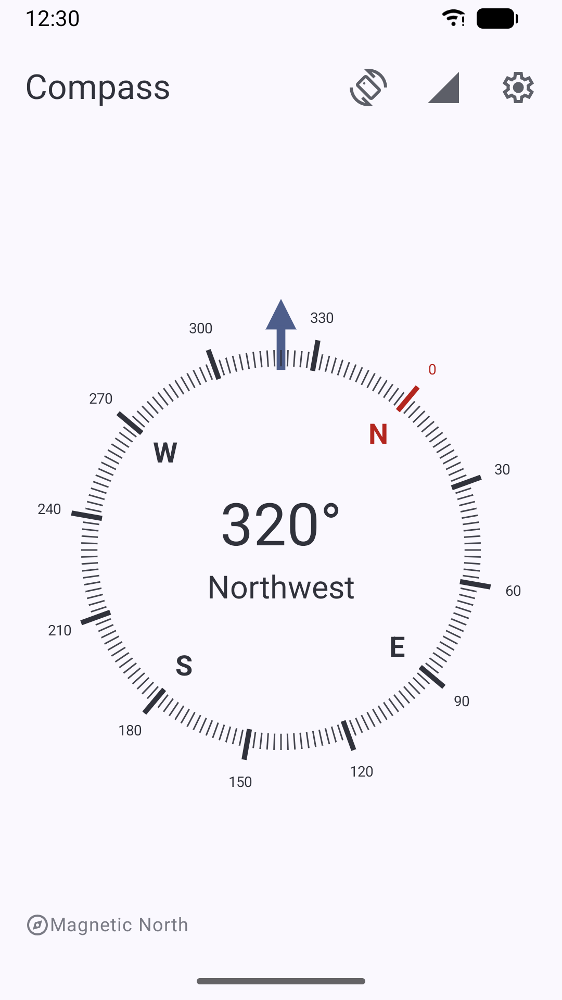
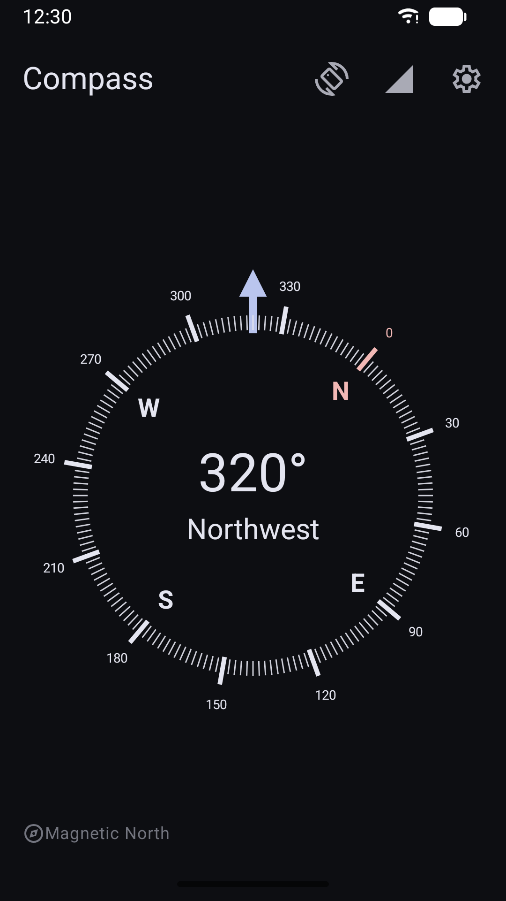

# Compass

### A simple and clean compass for Android

This project aims to provide a clean and reliable compass for Android.

## Features

* Can point to magnetic north as well as true north
* Switches to a sighting compass when held upright, for aiming at distant landmarks
* Shows exact degrees and cardinal direction
* Displays sensor status
* Haptic feedback
* Light and dark theme
* No advertisements
* No trackers
* No unnecessary permissions

## Screenshots

## Contributing

This is a hobby project maintained solo in my free time.
I don't accept pull requests or merge requests.
I'd rather spend the limited time I have working on the app itself than reviewing and integrating outside code changes.

If you find a bug or have an idea, feel free to [open an issue](https://github.com/Kr0oked/Compass/issues).
I read all of them and appreciate the feedback, but I can't promise that any given issue will be worked on.

Translations are handled by me with AI assistance and maintained directly in the repository.

## License

This project is licensed under the GNU GPL v3.
See the [LICENSE](LICENSE) file for the full license text.
